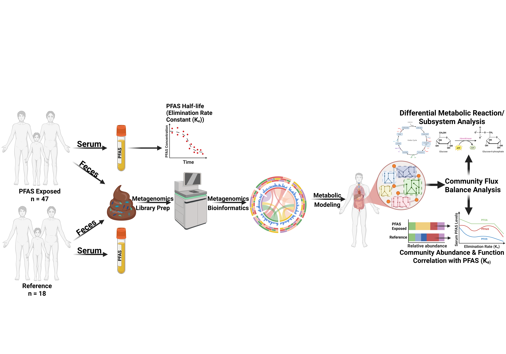

# Microbiome metabolic modelling reveals candidate functional signatures of PFAS elimination in a high-exposure human cohort

<p align="center">
  
</p>

This repository contains the scripts used to document the preprocessing, microbiome metabolic-model reconstruction, and manuscript figure-generation workflow for the PFAS gut microbiome manuscript. It is intended for peer reviewers and readers who want to follow the analytical steps and reproduce the reported figures from processed inputs. It is not a full raw-data archive.

## Workflow overview

1. **Read QC**: inspect raw sequencing quality with FastQC/MultiQC.
2. **Adapter/quality trimming**: trim low-quality bases and adapters.
3. **Human read removal**: map reads to GRCh38 and retain unmapped reads.
4. **Assembly and binning**: assemble metagenomes, bin contigs, and assess MAG quality.
5. **Taxonomic profiling**: classify samples or high-quality MAGs with Kraken2/Bracken.
6. **Phyloseq-ready tables**: convert Bracken outputs into OTU and taxonomy tables.
7. **Community metabolic reconstruction**: map detected species to APOLLO genome-scale models, reconstruct sample-specific communities with mgPipe, and export reaction, metabolite, and subsystem summaries.
8. **Model-output normalization**: prepare normalized model-derived reaction, metabolite, and subsystem abundance tables.
9. **Main figure generation**: recreate the six main-text figures from processed microbiome, metadata, PFAS, and model-output tables.
10. **Supplementary figure generation**: recreate supplementary figures and diagnostic analyses used to support the manuscript.

## Repository layout

```text
config/                         Example configuration files
metadata/                       Example sample manifest and metadata templates
docs/                           Workflow notes for manuscript methods
data/                           Placeholder for processed inputs; raw data are not stored here
results/                        Placeholder for generated figures and tables

scripts/preprocessing/          Sequencing preprocessing scripts
scripts/modeling/               APOLLO/mgPipe reconstruction and model-output preparation
scripts/figures/                Main-text figure scripts
scripts/supplementary_figures/  Supplementary figure scripts
```


## Community metabolic reconstruction

Community model reconstruction is run in MATLAB using APOLLO genome-scale gut microbial reconstructions and mgPipe:

```matlab
run('scripts/modeling/07_community_reconstruction.m')
```

Before running the MATLAB script, edit the configuration block at the top of `07_community_reconstruction.m` or provide equivalent local paths interactively.

Normalized model-output tables can then be prepared with:

```bash
Rscript scripts/modeling/08_Models_NormCount.r
```

## Notes for reproducibility

The scripts are intended to document the manuscript analysis workflow and reproduce figures from processed data tables. Some steps require external software, reference databases, or model resources that are not redistributed here, including:

- FastQC/MultiQC
- Read trimming software
- Bowtie2 or equivalent host-read removal tools
- Kraken2/Bracken databases
- Assembly/binning and MAG-quality tools
- MATLAB
- COBRA Toolbox / mgPipe
- APOLLO genome-scale gut microbial reconstruction resources

Local paths should be set through the provided configuration files or edited at the top of each script. Personal file paths and machine-specific directories have been removed.

## Data availability note

Raw sequencing data, PFAS measurements, and individual-level metadata may be subject to cohort data-use restrictions and are therefore not stored directly in this repository. Processed tables required to reproduce the figures should be placed in the `data/` subdirectories according to the paths documented in the figure scripts.

## Citation

If using this workflow or adapting the scripts, please cite the associated manuscript once available.
