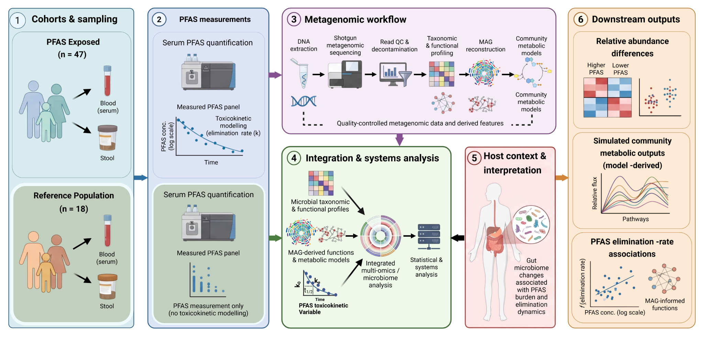

# PFAS–Microbiome: Ronneby systems analysis

<p align="center">
  
</p>

Public reproducibility companion for the Ronneby PFAS gut-microbiome manuscript.

**Release:** v1.2.0  
**NCBI BioProject:** [PRJNA1522707](https://www.ncbi.nlm.nih.gov/bioproject/PRJNA1522707)

## What is here

This repository contains the public analysis lineage and publication outputs:

- core scripts needed to reconstruct the taxonomic, functional, MAG and contextual analyses;
- final builders for Figures 1–6 and Figures S01–S06;
- machine-readable source/result tables;
- one PNG snapshot of each final figure for visual comparison;
- public accession information and compact environment documentation.

Development patches, failed attempts, repair/audit scripts, manuscript assembly utilities, scheduler wrappers, internal manifests and private filesystem paths are intentionally excluded.

## Start here

```text
data/ACCESSIONS.tsv              public deposition/accession status
workflow/README.md               ordered canonical analysis path
workflow/final_figures/          final Figure 1–6 builders
results/machine_readable/        release-safe source/result tables
results/figures/                 final PNG snapshots
docs/REPRODUCIBILITY.md          reproducibility scope and limitations
```

## Reproducibility scope

Raw human-containing reads, participant-level PFAS/clinical data and MAG FASTA files are not distributed through GitHub. Therefore restricted/raw preprocessing is documented in the manuscript rather than packaged here. The public repository focuses on the release-safe analysis lineage, derived source tables and exact publication-facing figure builders.

The manuscript Methods remain authoritative for study design, statistical definitions and software usage. Large external databases and model resources must be obtained from their original providers.

## Data availability

Study sequence deposition is registered under NCBI BioProject **PRJNA1522707**. MAG assemblies and associated metadata are being deposited or linked under that BioProject; individual accessions can be added to `data/ACCESSIONS.tsv` when assigned.

## Citation

See `CITATION.cff` and cite the associated manuscript when using this repository.

Repository: https://github.com/PoeticPremium6/PFAS-Microbiome
